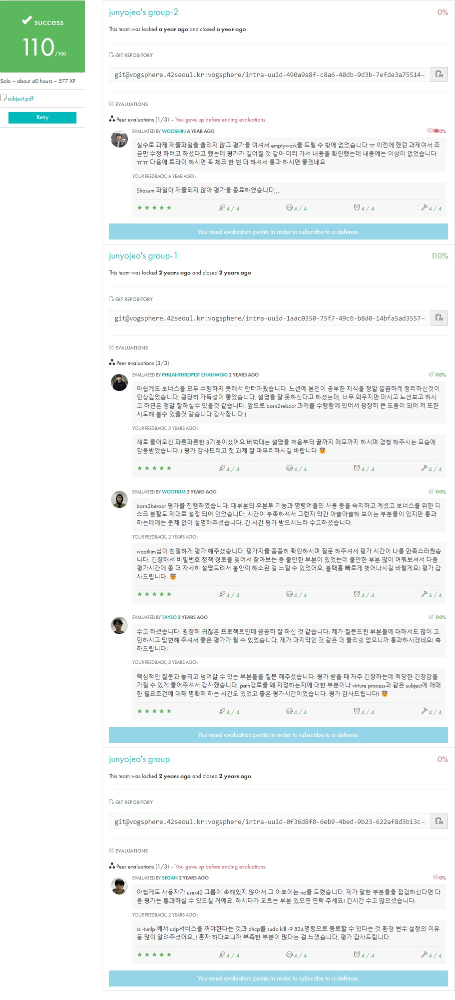

<div align="center">
  <h1>Born2beroot</h1>
  <p>시스템 관리자가 되기 위한 첫 걸음</p>

  [](https://github.com/your-username/Born2beroot)
  [](https://www.debian.org/)

  
</div>

## 🎯 프로젝트 소개
Born2beroot는 시스템 관리의 기초를 배우는 프로젝트입니다. 가상 머신을 설정하고, 엄격한 규칙에 따라 운영 체제를 구성하며, 다양한 서비스를 설정하는 과정을 통해 시스템 관리자의 역할을 이해합니다.

### 주요 학습 목표
- 가상화 시스템의 이해
- 운영 체제 설정 및 관리
- 시스템 보안 정책 구현
- 네트워크 서비스 구성
- 시스템 모니터링

## 📃 필수 요구사항

1. **기본 설정**
   - Virtual machine의 hostname은 42로 끝나야 함
   - UFW 방화벽을 활성화하고 4242 포트만 열어둬야 함
   - SSH 서비스는 4242 포트만 사용해야 하며, root로 SSH 연결 불가능해야 함

2. **사용자 및 그룹 설정**
   - root 외에 username으로 로그인한 user가 있어야 함
   - 이 사용자는 user42와 sudo 그룹에 속해있어야 함
   - Defense 시에 새로운 사용자를 생성하고 그룹에 등록할 수 있어야 함

3. **암호 정책**
   - 강력한 암호 정책 구현 필요:
     - 30일마다 만료 (`PASS_MAX_DAYS 30`)
     - 수정 전 최소 2일 사용 (`PASS_MIN_DAYS 2`)
     - 만료 7일 전 경고 메시지 (`PASS_WARN_AGE 7`)
     - 10자 이상, 대문자/숫자 포함 필수
     - 3개 이상 연속 동일 문자 불가
     - 사용자 이름 포함 불가
     - 이전 비밀번호와 7자 이상 달라야 함
     - root 비밀번호도 정책 준수 필요

4. **sudo 설정**
   ```bash
   Defaults    log_input
   Defaults    log_output
   Defaults    iolog_dir="/var/log/sudo/"
   Defaults    passwd_tries=3
   Defaults    authfail_message="authentication fail"
   Defaults    badpass_message="password fail"
   Defaults    requiretty
   Defaults    secure_path="/usr/local/sbin:/usr/local/bin:/usr/sbin:/usr/bin:/sbin:/bin:/snap/bin"
   ```

## 🧾 평가 준비

1. **가상 머신 기본 개념**
   - 가상 머신은 물리적 호스트 컴퓨터나 클라우드 서버의 자원(CPU, 메모리, 스토리지)을 사용
   - 실제 컴퓨터처럼 동작하는 가상 환경 제공
   - 주 운영체제와 독립적으로 동작

2. **운영체제 선택 이유**
   - **CentOS**
     - 패치가 빠르고 유틸의 양이 많음
     - 관리 툴 성능이 우수하고 호환성이 좋음
     - 주로 서버용 리눅스로 사용
   - **Debian**
     - 설치와 이용이 쉬워 진입장벽이 낮음
     - 개인용 리눅스로 많이 사용 (Ubuntu의 기반)

3. **패키지 관리자**
   - **APT (Advanced Package Tool)**
     - 소프트웨어 설치, 제거, 업데이트 관리
     - `/etc/apt/sources.list`에서 소스 관리
   - **Aptitude**
     - APT보다 방대한 소스 목록
     - apt-get, apt-cache 포함
     - 패키지 충돌 시 해결방법 제시
     - 설치된 패키지 목록 표시 기능

## 📚 주요 개념

### VirtualBox
- InnoTek이 개발하고 Oracle에서 배포하는 가상화 소프트웨어
- 원격으로 가상 컴퓨터 제어 가능
- 컴퓨터 시스템을 에뮬레이션하는 소프트웨어로, 가상 환경에서 OS나 응용 프로그램 실행 가능

### Kernel (커널)
- OS는 Kernel과 system program으로 구분
- 컴퓨터의 자원을 관리하는 핵심 역할
- 자원 접근 흐름: 사용자 → 시스템 프로그램(Shell) → 커널 → 컴퓨터 자원
- 주요 자원 추상화:
  ```
  물리적 자원        → 추상화한 자원
  CPU              → 태스크(Task)
  메모리            → 페이지/세그먼트
  디스크            → 파일
  네트워크          → 소켓
  디바이스 드라이버  → printer, GPU
  ```

### SELinux vs AppArmor 상세 비교

1. **기본 특징**
   ```
   SELinux:
   - NSA에서 개발
   - 더 강력한 보안
   - 설정이 복잡
   - RHEL 계열 기본

   AppArmor:
   - 더 간단한 설정
   - 경로 기반 접근 제어
   - Debian 계열 기본
   - 낮은 시스템 부하
   ```

2. **보안 정책**
   ```
   SELinux 모드:
   - Enforcing: 정책 위반 차단
   - Permissive: 위반 기록만
   - Disabled: 비활성화

   AppArmor 모드:
   - Enforce: 정책 위반 차단
   - Complain: 위반 기록만
   ```

## 🛠 구현 가이드

### LVM 파티션 설정

1. **파티션 구조 요구사항**
   ```
   필수 파티션:
   - /boot
   - root (/)
   - swap
   - home
   - var
   - srv
   - tmp
   - var/log
   ```

2. **파티션 생성 단계**
   ```bash
   # 1. 물리 볼륨(PV) 생성
   $ pvcreate /dev/sda1 /dev/sda2

   # 2. 볼륨 그룹(VG) 생성
   $ vgcreate LVMGroup /dev/sda1 /dev/sda2

   # 3. 논리 볼륨(LV) 생성
   $ lvcreate -L 500M -n lv_boot LVMGroup
   $ lvcreate -L 2G -n lv_root LVMGroup
   $ lvcreate -L 1G -n lv_swap LVMGroup
   $ lvcreate -L 3G -n lv_home LVMGroup
   $ lvcreate -L 3G -n lv_var LVMGroup
   $ lvcreate -L 3G -n lv_srv LVMGroup
   $ lvcreate -L 3G -n lv_tmp LVMGroup
   $ lvcreate -L 4G -n lv_var_log LVMGroup
   ```

### SSH 설정

1. **SSH 서버 설치 및 상태 확인**
   ```bash
   # SSH 서버 검색
   $ apt search openssh-server

   # SSH 설치
   $ apt install openssh-server

   # 상태 확인
   $ systemctl status ssh
   ```

2. **SSH 설정 파일 수정 (/etc/ssh/sshd_config)**
   ```bash
   # 파일 열기
   $ sudo vi /etc/ssh/sshd_config

   # 수정할 내용
   Port 4242               # 기본 포트(22)를 4242로 변경
   PermitRootLogin no      # root 계정 SSH 접속 차단
   ```

### UFW 설정

1. **UFW 설치 및 기본 설정**
   ```bash
   # UFW 설치
   $ sudo apt install ufw

   # UFW 활성화
   $ sudo ufw enable

   # 기본 정책 설정
   $ sudo ufw default deny incoming  # 들어오는 연결 기본 차단
   $ sudo ufw default allow outgoing # 나가는 연결 기본 허용
   ```

### Cron 설정

1. **Cron 문법**
   ```bash
   # 형식
   * * * * * command
   │ │ │ │ │
   │ │ │ │ └─ 요일 (0-7, 0,7=일요일)
   │ │ │ └─── 월 (1-12)
   │ │ └───── 일 (1-31)
   │ └─────── 시 (0-23)
   └───────── 분 (0-59)
   ```

2. **모니터링 스크립트 설정**
   ```bash
   # 스크립트 권한 설정
   $ sudo chmod 755 /usr/local/bin/monitoring.sh

   # cron 작업 추가
   $ sudo crontab -e
   */10 * * * * /usr/local/bin/monitoring.sh
   ```

### 📊 Monitoring.sh 전체 스크립트

```bash
#!/bin/bash

# Architecture
arch=$(uname -a)

# CPU Physical
cpuf=$(grep "physical id" /proc/cpuinfo | wc -l)

# CPU Virtual
cpuv=$(grep "processor" /proc/cpuinfo | wc -l)

# RAM
ram_total=$(free -m | awk '$1 == "Mem:" {print $2}')
ram_use=$(free -m | awk '$1 == "Mem:" {print $3}')
ram_percent=$(free | awk '$1 == "Mem:" {printf("%.2f"), $3/$2*100}')

# Disk
disk_total=$(df -BG | grep '^/dev/' | grep -v '/boot$' | awk '{ft += $2} END {print ft}')
disk_use=$(df -BM | grep '^/dev/' | grep -v '/boot$' | awk '{ut += $3} END {print ut}')
disk_percent=$(df -BM | grep '^/dev/' | grep -v '/boot$' | awk '{ut += $3} {ft+= $2} END {printf("%d"), ut/ft*100}')

# CPU Load
cpul=$(top -bn1 | grep '^%Cpu' | cut -c 9- | xargs | awk '{printf("%.1f%%"), $1 + $3}')

# Last Boot
lb=$(who -b | awk '$1 == "system" {print $3 " " $4}')

# LVM Check
lvmu=$(if [ $(lsblk | grep "lvm" | wc -l) -gt 0 ]; then echo yes; else echo no; fi)

# TCP Connections
tcpc=$(ss -ta | grep ESTAB | wc -l)

# User Log
ulog=$(users | wc -w)

# Network
ip=$(hostname -I | awk '{print $1}')
mac=$(ip link | grep "link/ether" | awk '{print $2}')

# Sudo
cmds=$(journalctl _COMM=sudo | grep COMMAND | wc -l)

# Output
wall "    #Architecture: $arch
    #CPU physical: $cpuf
    #vCPU: $cpuv
    #Memory Usage: $ram_use/${ram_total}MB ($ram_percent%)
    #Disk Usage: $disk_use/${disk_total}Gb ($disk_percent%)
    #CPU load: $cpul
    #Last boot: $lb
    #LVM use: $lvmu
    #TCP Connections: $tcpc ESTABLISHED
    #User log: $ulog
    #Network: IP $ip ($mac)
    #Sudo: $cmds cmd"
```

### 🔒 암호 정책 설정 파일

1. **/etc/login.defs**
```bash
# 패스워드 에이징(aging) 제어
PASS_MAX_DAYS   30      # 패스워드 최대 사용 기간
PASS_MIN_DAYS   2       # 패스워드 최소 사용 기간
PASS_WARN_AGE   7       # 패스워드 만료 전 경고 기간

# 패스워드 길이 설정
PASS_MIN_LEN    10      # 최소 패스워드 길이

# 패스워드 암호화 방식
ENCRYPT_METHOD SHA512   # SHA512 방식으로 암호화
```

2. **/etc/pam.d/common-password**
```bash
# 패키지별 기본 모듈 ("Primary" 블록)
password        requisite                       pam_pwquality.so retry=3
password        [success=1 default=ignore]      pam_unix.so obscure use_authtok try_first_pass yescrypt
password        requisite                       pam_deny.so
password        required                        pam_permit.so

# 모든 모듈이 실패할 경우의 대체 설정
password        requisite                       pam_deny.so

# 스택에 성공 값이 없는 경우를 위한 기본값 설정
# 모듈들이 성공 코드를 설정하지 않아 오류가 발생하는 것을 방지
password        required                        pam_permit.so

# 추가 패키지별 모듈 ("Additional" 블록)
password        optional        pam_gnome_keyring.so 

# 패스워드 품질 요구사항:
# retry=3: 실패 전 3번의 시도 허용
# minlen=10: 최소 10자 이상
# ucredit=-1: 최소 1개의 대문자 필수
# dcredit=-1: 최소 1개의 숫자 필수
# maxrepeat=3: 동일 문자 최대 3번까지만 연속 사용 가능
# reject_username: 사용자 이름 포함 불가
# difok=7: 이전 비밀번호와 최소 7자 이상 달라야 함
# enforce_for_root: root 사용자에게도 이 규칙 적용
password        requisite       pam_pwquality.so retry=3 minlen=10 ucredit=-1 dcredit=-1 maxrepeat=3 reject_username difok=7 enforce_for_root
```

### 💾 파티션 마운트 설정

**/etc/fstab**
```bash
# /etc/fstab: static file system information
# <file system>                           <mount point>   <type>  <options>       <dump>  <pass>
UUID=<uuid>                               /boot           ext4    defaults        0       2
/dev/mapper/LVMGroup-root                 /               ext4    defaults        0       1
/dev/mapper/LVMGroup-swap                 none            swap    sw              0       0
/dev/mapper/LVMGroup-home                 /home           ext4    defaults        0       2
/dev/mapper/LVMGroup-var                  /var            ext4    defaults        0       2
/dev/mapper/LVMGroup-srv                  /srv            ext4    defaults        0       2
/dev/mapper/LVMGroup-tmp                  /tmp            ext4    defaults        0       2
/dev/mapper/LVMGroup-var_log              /var/log        ext4    defaults        0       2

# 옵션 설명:
# defaults: rw, suid, dev, exec, auto, nouser, async
# dump: 0 = 백업 불필요, 1 = 백업 필요
# pass: 0 = fsck 검사 안함, 1 = 루트 파티션, 2 = 일반 파티션
```

## ✅ 평가 체크리스트

### 설치 전 준비사항
1. **VirtualBox 설정**
   ```bash
   # 필요 사양
   - 메모리: 최소 1GB
   - 디스크: 최소 8GB
   - 네트워크: NAT 설정
   ```

2. **설치 미디어**
   ```bash
   # Debian 다운로드
   - debian-11.x.0-amd64-netinst.iso 준비
   - SHA256 체크섬 확인
   ```

### 평가 시연 순서
1. **시스템 확인**
   ```bash
   # 운영체제 확인
   $ uname -a
   
   # 파티션 확인
   $ lsblk
   
   # 패키지 확인
   $ dpkg -l | grep ssh
   $ dpkg -l | grep ufw
   $ dpkg -l | grep sudo
   ```

2. **보안 설정 확인**
   ```bash
   # UFW 상태
   $ sudo ufw status
   
   # SSH 설정
   $ sudo systemctl status ssh
   $ sudo cat /etc/ssh/sshd_config
   
   # 암호 정책
   $ sudo chage -l <username>
   ```

3. **사용자 관리 시연**
   ```bash
   # 새 사용자 생성
   $ sudo adduser new_username
   
   # 그룹 추가
   $ sudo usermod -aG sudo,user42 new_username
   
   # 암호 정책 적용 확인
   $ sudo passwd new_username
   ```

## 🔧 트러블슈팅 가이드

### 일반적인 문제 해결
1. **부팅 문제**
   ```bash
   # GRUB 복구
   $ sudo update-grub
   
   # 파일시스템 체크
   $ sudo fsck /dev/sda1
   ```

2. **네트워크 문제**
   ```bash
   # 네트워크 상태 확인
   $ ip a
   $ sudo systemctl restart networking
   
   # SSH 연결 실패
   $ sudo systemctl restart ssh
   $ sudo netstat -tulpn | grep 4242
   ```

3. **디스크 공간 문제**
   ```bash
   # 용량 확인
   $ df -h
   
   # 큰 파일 찾기
   $ sudo du -h / | sort -rh | head -n 10
   ```

### 자주 발생하는 오류

1. **SSH 접속 오류**
   - 원인: 포트 설정, 방화벽 규칙, 권한 문제
   ```bash
   # 해결 방법
   $ sudo ufw allow 4242
   $ sudo chmod 600 ~/.ssh/authorized_keys
   $ sudo chown -R $USER:$USER ~/.ssh
   ```

2. **sudo 권한 문제**
   - 원인: 그룹 설정, sudoers 파일 문법
   ```bash
   # 해결 방법
   $ su -
   $ usermod -aG sudo username
   $ visudo  # 설정 확인
   ```

3. **cron 작동 문제**
   - 원인: 스크립트 권한, 경로 문제
   ```bash
   # 해결 방법
   $ sudo chmod +x /usr/local/bin/monitoring.sh
   $ sudo chown root:root /usr/local/bin/monitoring.sh
   $ sudo systemctl restart cron
   ```

## 📥 설치 가이드

### VirtualBox 설치 및 설정
1. **가상머신 생성**
   ```bash
   1. '새로 만들기' 클릭
   2. 이름: <username>42
   3. 종류: Linux
   4. 버전: Debian (64-bit)
   5. 메모리: 1024MB
   6. 하드디스크: 새로 만들기 (8GB)
   ```

2. **시스템 설정**
   ```bash
   1. 저장소 → 광학드라이브 → Debian ISO 선택
   2. 네트워크 → 어댑터 1 → NAT
   3. 디스플레이 → 비디오 메모리 → 16MB
   ```

### Debian 설치 과정
1. **기본 설정**
   ```bash
   1. Install (그래픽 설치 X)
   2. 언어: English
   3. 위치: Other → Asia → Korea
   4. 로케일: en_US.UTF-8
   5. 키보드: American English
   ```

2. **파티셔닝**
   ```bash
   1. Manual 선택
   2. SCSI3 (sda) 선택
   3. pri/log 선택 → Create new partition
   4. LVM 설정 진행
   ```

3. **시스템 설치**
   ```bash
   1. base system 설치
   2. GRUB boot loader 설치
   3. /dev/sda 선택
   ```

## 💡 유용한 팁

1. **평가 전 준비사항**
   - 모든 설정 파일의 백업본 생성
   - 가상머신 스냅샷 생성
   - 주요 명령어 치트시트 준비

2. **평가 중 주의사항**
   - 명령어 실행 전 충분한 설명
   - 설정 변경 시 백업 강조
   - 보안 관련 설정의 이유 설명

3. **문제 해결 시**
   - 로그 파일 확인이 첫 번째 단계
   - 설정 파일 문법 검증
   - 서비스 재시작 고려